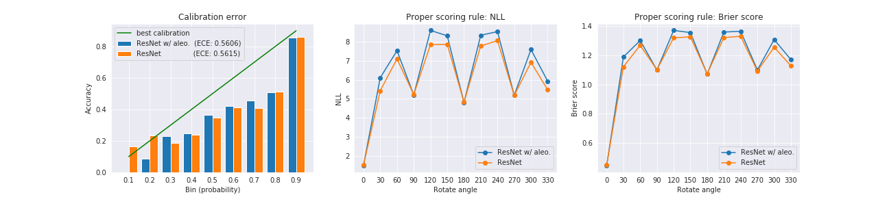
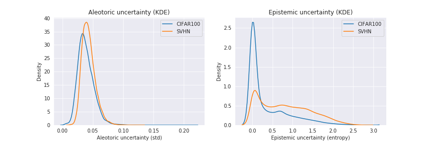
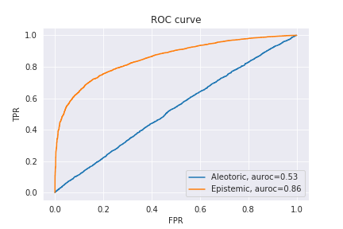

# What uncertainties
Pytorch implementation of ["What uncertainties do we need in bayesian deep learning for computer vision"](https://papers.nips.cc/paper/7141-what-uncertainties-do-we-need-in-bayesian-deep-learning-for-computer-vision.pdf) 
<br>
This code is implemented only for the image classification task (Cifar100).

## Prerequisites
* Python 3.6
* Pytorch 0.4.0

## Train
To train the model with Cifar100 dataset, run the code by
```
$ nohup python main.py --gpu_number=0 --arch=resnet_aleo & 
```
Log is updated and the checkpoint is saved in `./runs/resnet_aleo/` directory. <br>
To train the resnet baseline model, change the `--arch` argument to `resnet`.

## Results
We show the experiments in this section. 
We first compare the proposed network [2] (valid acc. 71.1%) with the baseline resnet network [1] (valid acc. 70.7%) by observing the calibration effect. 
After that, we compare the aleotoric uncertainty and the epistemic uncertainty in the out-of-distribution (Cifar100 vs SVHN) setting.
Finally, we show the ROC curve with aleotoric and epistemic, respectively, to observe which uncertainty measure correlates with the correctness.
(The computation time in the test phase is not numerically compared since it does not increase significantly. This is because only the sampling from the logit space is added, which is a fraction of the network's forward propagation.)

### Calibration

<p align="center">
  
</p>
<!--  -->

We first compare the proposed network and the baseline network by the calibration benchmarks. 
The first figure at the above shows that the propose network has lower expected calibration error (ECE) (lower is better), though it is not significantly different. 
The second and third figures provide the comparison in the proper scoring rules (NLL and Brier score) (lower is better) when input images are rotated. 
In the in-distribution setting (when rotation angle is 0), the propsed network has better performance than the baseline network, where the proposed network has 1.47 and 0.44 for NLL and Brier score, respectively, and the baseline network has 1.50 and 0.45 for NLL and Brier score, respectively. 
However, when the input images are regarded to be sampled from out-of-distribution by rotating the original images, the baseline network has better performance in the calibration. 
To sum up, the proposed method has a little effect on calibration in the in-distribution setting and worse effect in the out-of-distribution setting.

### Uncertainty in out-of-distribution setting
<p align="center">
  
</p>

We perform another out-of-distribution experiment by comparing the aleotoric uncertainty and the epistemic uncertainty with the Cifar100 dataset and the SVHN dataset. The first figure at the above shows that there is a small difference in the density estimation between Cifar100 and the SVHN. On the other hand, the second figure shows that two distributions are different. While Cifar100 data are leaned to have small epistemic uncertainty, the SVHN data have various epistemic entropy. This experiments show that the proposed method works well for measuring the aleotoric uncertainty and the epistemic uncertainty.

### ROC curve
<p align="center">
  
</p>

We observe the correlation of the correctness with each uncertainty measure by drawing the ROC curve, and the results are shown above. We see that aleotoric uncertainty does not have correlation with correctness, while the epistemic uncertainty has 0.86 for the auroc.

## References
[1] He, Kaiming, et al. "Deep residual learning for image recognition." Proceedings of the IEEE conference on computer vision and pattern recognition. 2016. <br>
[2] Kendall, Alex, and Yarin Gal. "What uncertainties do we need in bayesian deep learning for computer vision?." Advances in neural information processing systems. 2017.
